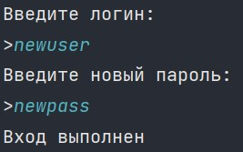

## FTP сервер

### Цель работы

Научиться программно работать с файлами и файловой системой, читать, создавать, перемещать и передавать файлы по сети

### Дополнительные задания:

1. Ограничьте возможности пользователя рамками одной определенной директории. Внутри нее он может делать все, что хочет: создавать и удалять любые файлы и папки. Нужно проследить, чтобы пользователь не мог совершить никаких действий вне пределов этой директории. Пользователь, в идеале, вообще не должен догадываться, что за пределами этой директории что-то есть.

2. Добавьте логирование всех действий сервера в файл. Можете использовать разные файлы для разных действий, например: подключения, авторизации, операции с файлами.

3. Добавьте возможность авторизации пользователя на сервере.

4. Добавьте возможность регистрации новых пользователей на сервере. При регистрации для пользователя создается новая рабочая папка (проще всего для ее имени использовать логин пользователя) и сфера деятельности этого пользователя ограничивается этой папкой.

5. Реализуете квотирование дискового пространства для каждого пользователя.

6. Реализуйте учётную запись администратора сервера.

7. Напишите отладочный клиент. Клиент должен подключаться к серверу и в автоматическом режиме тестировать корректность его работы. Используйте подход, аналогичный написанию модульных тестов. Клиент должен вывести предупреждающее сообщение, если сервер работает некорректно. 

